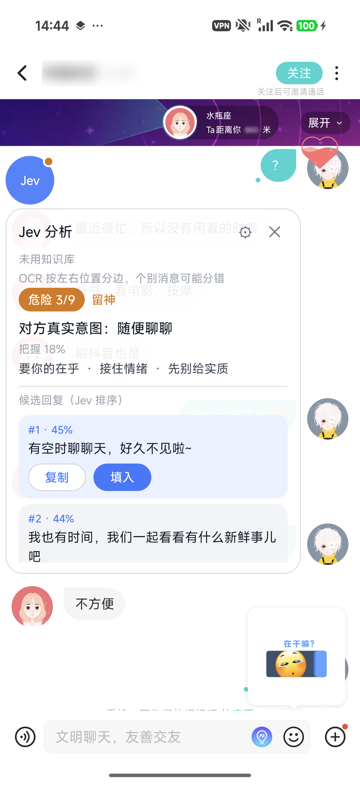
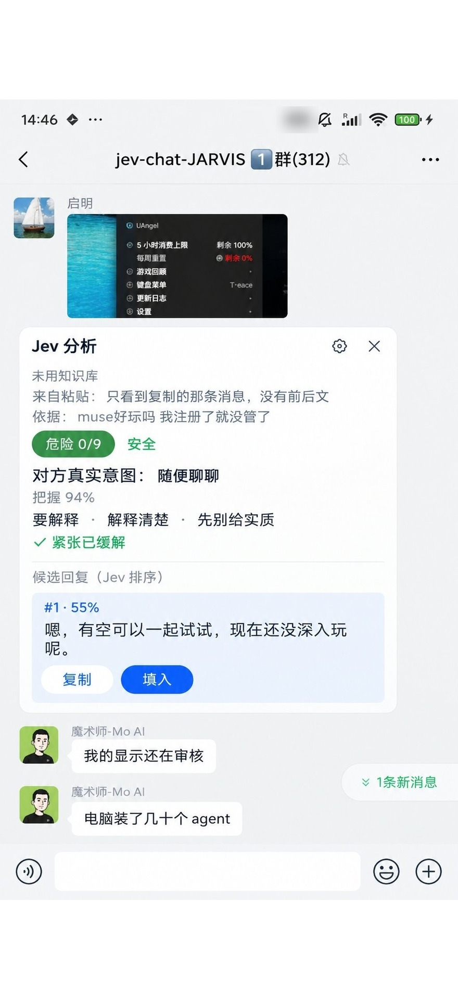

# Jev 聊天助手

主仓库：[ismoshushi/jev-chat-jarvis](https://github.com/ismoshushi/jev-chat-jarvis)。

本项目基于 [jev-chat/jev-chat-jarvis](https://github.com/jev-chat/jev-chat-jarvis)（MIT License）扩展，一切代码遵循同样的 [MIT License](LICENSE)，归原项目及其贡献者所有的部分版权归原项目所有。

## 与原项目的差异

- **适配了更多通用聊天软件**：一键「截屏分析」/「粘贴分析」，未专门适配的聊天 App 也能用；QQ、X、飞书保持自动读取与一键填入。

## 效果演示

| 截屏分析（未适配 App） | 粘贴分析（防截屏 App） |
| --- | --- |
|  |  |

## 测试与免责声明

**欢迎测试，一起完善。** 本项目的所有功能均由用户主动触发（点按钮、复制、粘贴等已知常规操作），不使用任何非常规手段。欢迎大家加入测试、提 Issue 或 PR。

---

## ⚠️ 使用前必读 · 免责声明 ⚠️

<b>温馨提示：使用本工具可能会引起「微信不能截屏」的问题，请大家悉知！</b>

> [!WARNING]
> **使用本工具可能会导致微信无法截屏**，此为已知问题，请使用前务必知悉并自行评估。

**请在使用之前完整阅读以下声明：**

- 本项目仅供学习与技术研究，请务必通过**合法途径**使用；
- 使用前请自行了解并遵守相关平台的服务条款及当地法律法规；
- 使用本工具**可能会引起微信不能截屏**等问题，请悉知；
- **除上述已明确提示的问题外，其他一切问题概不负责**；
- **一旦下载、安装或使用本项目，即视为已阅读、理解并同意本声明的全部内容**；如不同意，请立即停止使用并卸载。

其余细节见 [CHANGELOG](CHANGELOG.md)。
